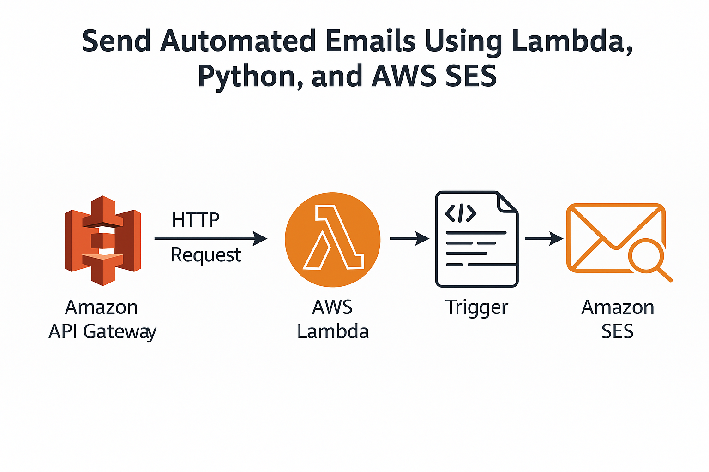

# 📧 Automated Email Notifications using AWS Lambda and SES

✅Week 8 Mentorship Project – Group B

✅GROUP B TEAM: Fagoroye Sanumi O.
                 & Lawal Jonathan
               
**TOPIC**: Send Automated Emails Using Lambda, Python, and AWS SES

This project implements an automated serverless system that sends alert emails via AWS SES whenever an IAM user's access key is approaching expiration. The notification is triggered via API Gateway, powered by a Python-based AWS Lambda function.

## Architecture

**Components:**

- **AWS Lambda** (Python): Checks IAM user access keys and sends warning emails via SES.

- **AWS SES**: Sends the email. Configured in Sandbox mode.

- **API Gateway**: Exposes an HTTP POST endpoint to trigger the Lambda.

- **CloudWatch Logs**: Captures logs for Lambda execution and debugging.

- **Terraform**: Provisions all infrastructure.

## Features

- Email alerts before IAM access key expiration (default 10 days before)

- SES Sandbox-compatible (both sender and receiver must be verified)

- Uses environment variables to configure IAM user, email recipients, etc.

- Fully managed using Terraform

- Logs activity to CloudWatch.

## 🚀 How It Works

1. You trigger the API Gateway endpoint via HTTP `POST`

2. The Lambda runs:

   - Lists IAM access keys for the specified user

   - Calculates key age

   - If any key is expiring soon, it sends an email using SES

3. If no keys are near expiry, it returns a quiet message

### 🛠️ SES Setup Using AWS CLI

#### Step 1: Verify Email Addresses

In SES **sandbox mode**, you must verify both sender and recipient addresses:

# Verify sender email

aws ses verify-email-identity --email-address sender@example.com

# Verify recipient email (if in sandbox)

aws ses verify-email-identity --email-address recipient@example.com

Then confirm the verification link sent to your email.

📌 **Set Up Your Variables**

aws_region      = "your region"
sender_email    = "sender email"
recipient_email = "receiver email"
iam_user        = "your iam_user"
expiry_days     = 

📌 **Zip Your Lambda Function**

bash scripts/zip_lambda.sh

📌 **Deploy with Terraform**

cd terraform

terraform init

terraform apply -auto-approve

📌 **Trigger the Email**

curl -X POST https://<your-api-id>.execute-api.<region>.amazonaws.com/prod/send

If a key is close to expiring, the email will be sent via SES.

🔐 IAM Access Key Expiry Notification

✉️ Sample Email Output

Hi Team,

- Access key for IAM user sheyi is expiring in 2 days.

Regards,
Automated Lambda Function

🧼 **Cleanup**

cd terraform

terraform destroy

